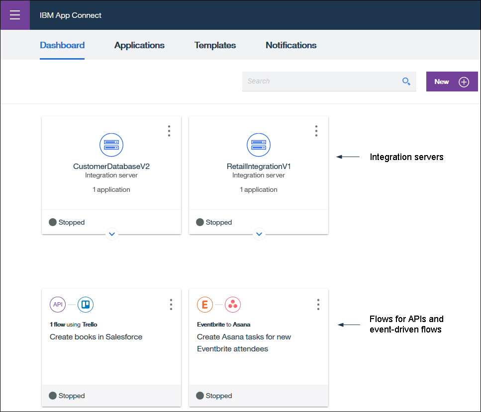
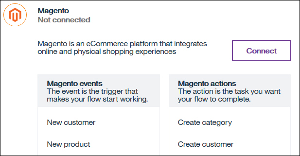
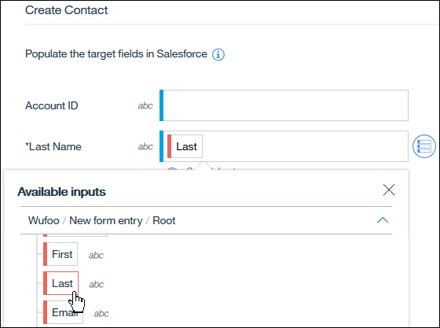
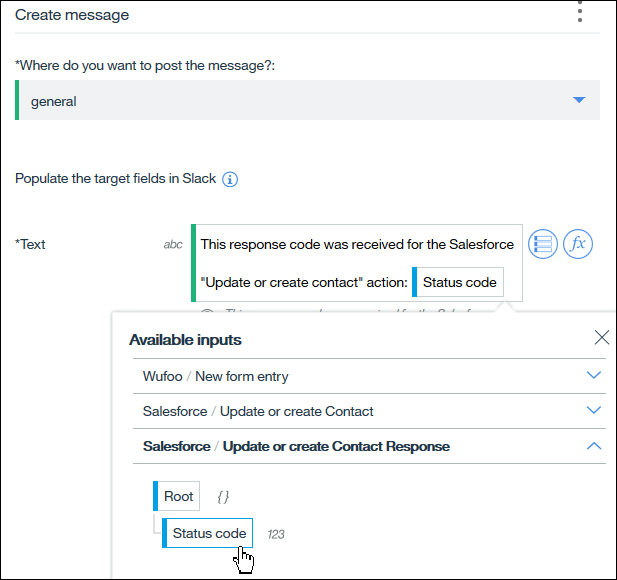
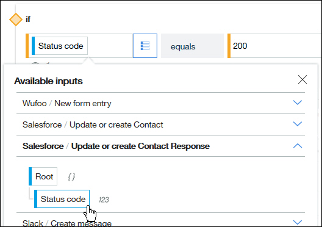

---

copyright:
  years: 2017
lastupdated: "2019-02-06"

---

{:new_window: target="_blank"}
{:shortdesc: .shortdesc}
{:screen: .screen}
{:pre: .pre}
{:table: .aria-labeledby="caption"}
{:codeblock: .codeblock}
{:tip: .tip} 
{:download: .download}

# IBM App Connect concepts
{: #concepts}

{{site.data.keyword.appconservicefull}} is a business-friendly tool that you can use to integrate your cloud-based or on-premises applications to automate tedious and repetitive tasks.

Here we'll explain the features and terminology of {{site.data.keyword.appconserviceshort}}:

-   [Flows](#flows)
-   [Applications](#apps)
-   [Actions](#actions)
-   [Data mapping](#transforms)
-   [BAR files and integration servers](#barfiles)

## Flows
{: #flows}

There are two types of flow that you can create in {{site.data.keyword.appconserviceshort}}: an event-driven flow and a flow for an API.

In an event-driven flow, you identify an event that can occur in your first application (the source application), and actions that can be performed in one or more target applications. The flow links the event to the actions so that, whenever the event occurs in the source application, the action is automatically triggered in the target applications. Each successfully completed action counts towards your monthly quota. When you create a flow, you add your applications, and choose actions. Then you map the data that you want to transfer between your applications.

For example, you might create a flow so that whenever someone registers as a new attendee with Eventbrite (the event), {{site.data.keyword.appconserviceshort}} automatically retrieves details of the attendee from Salesforce and creates a new task in Asana (the actions).

For more information, see [Creating an event-driven flow ](https://developer.ibm.com/integration/docs/app-connect/tutorials-for-ibm-app-connect/creating-event-driven-flow/).

A flow for an API contains a request, one or more target application actions, and a response. The request uses a model that you define to request the creation, replacement, or retrieval of data objects in your applications. When the request is submitted, each target application performs its action, and then the flow returns a response that either confirms that the actions were successful, or returns the data that was requested.

For more information, see [Creating flows for an API ](https://developer.ibm.com/integration/docs/app-connect/tutorials-for-ibm-app-connect/creating-flows-api/).

As well as adding applications to your flows, you can also add nodes from the **Logic** tab that allow you to configure how you process data. For example, use the If node to add some conditional processing - performing different actions according to the data that you receive (see [Adding conditional logic to a flow ](https://developer.ibm.com/integration/docs/app-connect/tutorials-for-ibm-app-connect/adding-conditional-logic-flow/)). And use the For each node when you want to perform an action for each record that's returned by a retrieve action (see [Retrieving items from your applications ](https://developer.ibm.com/integration/docs/app-connect/tutorials-for-ibm-app-connect/using-ibm-app-connect-retrieve-items-applications/)).

If you're an IBM Integration Bus or App Connect Enterprise developer, you can also create complex integration solutions by developing message flows in the Integration Toolkit and packaging them into BAR files.

Your flows and integration servers are represented by tiles on the App Connect dashboard. The tiles show summary information about the flow, API, or integration server, such as whether a flow is running or stopped, and if it's run successfully, or produced an error. You can click the tick and exclamation point icons to see when the flow last ran successfully, or what errors were raised. Click the three dots  to open a menu that allows you to start, stop, edit, or delete your resources. Flows have to be stopped before you can edit them.

## Applications
{: #apps}

When creating event-driven flows or flows for APIs, _applications_ are the cloud-based software applications that you're connecting.  You can see a list of the applications that you can connect with {{site.data.keyword.appconserviceshort}} on the **Applications** page. Click an application to find out more about it, to see what events and actions are supported, and to connect to your own account. You can have multiple accounts connected to each application and switch between them on the Appications page. After you've connected to your account, you can also update or remove your account on this page.

You don't have to connect to your applications on the Applications page; you can also connect in the flow editor as you add the applications to your flow. Many applications require just a user name and password, but some need more information. You can find out how to find this information in the [How-to guides for apps ](https://developer.ibm.com/integration/docs/app-connect/how-to-guides-for-apps/).

If you're using {{site.data.keyword.appconservicefull}} to run Integration Bus or App Connect Enterprise solutions in the cloud, an _application_ is the container that holds your message flows, libraries, and other resources that are required by your solution. 

## Actions
{: #actions}

You can add several types of action to your flows. Common actions are create, retrieve, and update or create, but some applications have specific actions. For example, the Watson Personality Insights application has an action called "Analyze personality". You can see a list of actions that are supported for applications in {{site.data.keyword.appconserviceshort}} by typing the action type in the search field at the top of the Applications page:

**Create**

As the name suggests, the create action creates an object or record in an application. For example, if someone signs up to your event or submits a completed form, you might want to create a record for that person in your CRM or marketing application. Or if someone opens a ticket in your help desk application, you might want to create an email or instant message to ensure that someone deals with it straight away. If there’s a possibility that the object that you want to create might already exist, you can use an *update or create* action instead.

For some applications, you might have to provide some extra information when you add a create action to a flow so that your flow knows where to create the object. For example, if you're using a project management application like Asana or Trello, when you create a task or a card, you'll need to specify the project or the board where you want to add it.

**Update or create**

The update or create action changes an existing record in your target application if it exists, but creates the record if it doesn’t already exist. It’s also known as an upsert (update or insert) action.

For example, say someone has submitted a Wufoo form with a change of address. If the contact is already in your CRM system, you want to update their address; but if they’re not, you want to add them. Like the retrieve action, when you choose an action to update data in one of your applications, you can add one or more conditions to ensure that you’re updating the right information.

If there’s more than one record in your target system that matches your criteria, you’ll see an error for the flow on the dashboard, and the flow won’t update or create any records. For example, maybe you have more than one contact with the same first and last names. So you could try to match a contact by using unique data, such as their email address.

The status codes that you’re likely to see in response to an update or create action are:

-   200: A record was updated
-   201: A record was created

You can use these response codes later in your flow. Maybe you want to take different actions depending on whether a record was updated or created. For an example of defining actions based on response codes, see the tutorial [Creating an event-driven flow that updates or creates a contact in Salesforce and updates Asana whenever you receive a form in Wufoo ](https://developer.ibm.com/integration/docs/app-connect/tutorials-for-ibm-app-connect/creating-event-driven-flow-updates-creates-contact-salesforce-updates-asana-whenever-receive-form-wufoo/).

**Retrieve**

The retrieve action gets information from an application so that you can use it in another application.

When you add an action to your flow to retrieve objects, you can define one or more conditions to make sure that you’re retrieving the right items. Or, if you just want to retrieve all items of a particular type, you can delete the condition. You can also define how many items you want to retrieve, and what happens if {{site.data.keyword.appconserviceshort}} finds more than or less than that number.

You can handle your retrieved items in two ways:

-   You can add a "For each" node after the retrieve action to perform an action for each of the items that were retrieved.
-   You can add another action after the retrieve action to process the list of retrieved items. This is a single action, no matter how many items are returned – such as creating an email that lists all the retrieved items.

You can also decide what action to take based on the status code that you get in response to the retrieve action. You could use an “If” node to perform different actions for different status codes. The status codes that you’re likely to see in response to a retrieve action are:

-   204: No records were found
-   200: All records in the application match the condition
-   206: The specified maximum number of records were retrieved, but more matching records exist in the application

For more information, see [Retrieving items from your applications ](https://developer.ibm.com/integration/docs/app-connect/tutorials-for-ibm-app-connect/using-ibm-app-connect-retrieve-items-applications/).

## Data mapping
{: #transforms}

When you've created a flow, added your applications, and selected appropriate actions, you need to specify what information you want to transfer between your applications. You'll see in the flow editor that when you add an action to your flow, you'll see a list of available fields for that application, which you can populate with data from your source application, or previous actions in the flow.

Some fields are mandatory, and they're marked with an asterisk. For example, when you're creating a lead in Salesforce, you must specify a last name:

When you click in one of these fields, you'll see a couple of icons: **Insert reference** and **Apply a Function**. If you click **Insert reference**, you'll see the available data that you can put in that field from preceding applications in the flow. The following example shows that we can choose fields from the Wufoo source application, or from a previous Salesforce action in the flow. We can also use the status code from the Salesforce update or create action.

In the following example, our flow is triggered by a new completed form being received in Wufoo. We want to create a contact in Salesforce for the person who's submitted the form. So when we add our Salesforce "Create contact" action to the flow, we copy the details for our contact from the Wufoo form. Here we can see that for the last name of the Salesforce contact, we've selected the last name of the Wufoo form submitter. You can see that the mapped field is from Wufoo because of the colour:

In the following example, we've added a Slack "Create message" action to the flow after a Salesforce "Update or create contact" action. We simply want to put a message on Slack to say what response code was received for the Salesforce action:

You can see that in the **Text** field for the Slack "Create message" action, we've typed a message, then mapped in the status code for the Salesforce "Update or create contact" action.

Here's another example of mapping response codes in a different way. This time, we've added an "If" node after a Salesforce "Update or create contact" action because we want to perform different actions depending on whether an existing Salesforce contact was updated, or a new contact was created. In this case, a response code of "200" means that the contact was updated. So this branch of the "If" node will contain an action that's specific to an updated record.

The **Apply a function** icon  shows you a list of transformation functions that you can use to customize the data that you're passing through your flow. These functions can be as simple as converting a particular field to upper or lower case, or slightly more complex, such as finding and replacing specific patterns in the data. They can also be as powerful as forming regular expressions. You can either select the function that you want from the list, or you can type it in yourself. The syntax of the functions is JSONata, a lightweight query and transformation language. For more information, see [http://jsonata.org ](http://jsonata.org).

## BAR files and integration servers
{: #barfiles}

A BAR file is a compressed file to which you add deployable resources in IBM Integration Bus or App Connect Enterprise.  When you develop an integration solution in Integration Bus or App Connect Enterprise, you package your message flows and all the resources that those message flows use in a BAR file, then deploy the BAR file to an integration server.  That server can be on premises or in {{site.data.keyword.appconserviceshort}}.  You can run your Integration Bus or App Connect Enterprise solutions in App Connect, without the need to acquire and maintain an IT infrastructure.  When you upload a BAR file to App Connect, an integration server is created to run the contents of the BAR file.  You can configure basic authentication and secure connectivity between your cloud-based and on-premises resources (see [Running your Integration Bus solutions in App Connect ](https://developer.ibm.com/integration/docs/app-connect/tutorials-for-ibm-app-connect/running-your-ibm-integration-bus-solutions-in-ibm-app-connect-enterprise-beta-plan)).  
