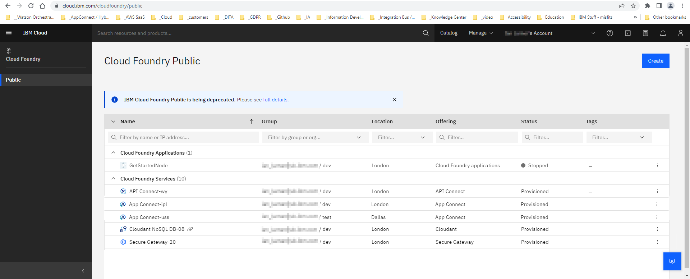

---

copyright:
  years: 2017, 2022
lastupdated: "2022-12-12"

keywords: app connect, integration, application, deprecation

subcollection: AppConnect

content-type: deprecation

---

{:new_window: target="_blank"}
{:shortdesc: .shortdesc}
{:screen: .screen}
{:pre: .pre}
{:table: .aria-labeledby="caption"}
{:codeblock: .codeblock}
{:tip: .tip}
{:download: .download}
{:step: data-tutorial-type='step'}

# Deprecation of {{site.data.keyword.appconservicefull}} service plans {#index}

Service plans for {{site.data.keyword.appconservicefull}} have been deprecated, and any instances of {{site.data.keyword.appconnect_notm}} plans that still exist on 30 November 2023 will be deleted. To continue using {{site.data.keyword.appconnect_notm}}, you should migrate to an alternative provision.

## Overview {#overview .section}

IBM has announced the deprecation of {{site.data.keyword.appconservicefull}} service plans \(Lite, Professional, Enterprise\). At 30 November 2023, any {site.data.keyword.appconservicefull}} instances will be permanently deleted and deprovisioned.

The service plans were made available to customers to provide IBM-managed instances of {{site.data.keyword.appconnect_notm}} running on IBM Cloud Foundry, and have hosted thousands of integration flows over many years. But as technology moves on, newer and more sophisticated technologies have become available for our IBM Cloud users.

The following describes the details of the deprecation, possible migration targets, and additional information.

## Timeline {#timeline .section}

The timeline for this deprecation is as follows:

|Stage|Date|Description|
|-----|----|-----------|
|Announcement|December 2022|Announcement of the deprecation of {{site.data.keyword.appconservicefull}} service plans. All current users of {{site.data.keyword.appconservicefull}} as of early December 2022, will receive an email with information about the deprecation. Notifications will be put into the {{site.data.keyword.appconservicefull}} service and documentation.|
|End-of-Marketing|December 2022|New instances of {{site.data.keyword.appconservicefull}} service plans cannot be created by any user.|
|Reminders|Ongoing|Periodic reminders will be sent to all users with running instances of {{site.data.keyword.appconservicefull}} that the end-of-support date is coming, with increasing frequency as the date approaches.|
|End-of-Support|30 November 2023|All instances of {{site.data.keyword.appconservicefull}} will be permanently disabled and deprovisioned.|

## Migrating {{site.data.keyword.appconnect_notm}} to an alternative provision { .section}

The high-level procedure to migrate from {{site.data.keyword.appconservicefull}} to an alternative provision:

1.  [Identify the {{site.data.keyword.appconnect_notm}} instances affected](#identify)
2.  [Preserve the artifacts that you want to migrate](#preserve)
3.  [Migrate to an alternative provision of {{site.data.keyword.appconnect_notm}}](#migrate)

## Identify the {{site.data.keyword.appconnect_notm}} instances affected {#identify}

You can check the instances of {{site.data.keyword.appconservicefull}} \(and other services\) that are affected by viewing your [IBM Cloud Foundry Public](https://cloud.ibm.com/cloudfoundry/public) page. For example:

## Preserve the artifacts that you want to migrate {#preserve}

1.  For each event-driven flow and API flow, preserve the flow definition file and app connection details.

    An exported flow definition file preserves all the flow's configuration settings, other than the connection details for the apps used in the flow.

    -   If you created the flow in your {{site.data.keyword.appconnect_notm}} instance, you can export the flow. For more information about exporting flow definition files, see [Exporting a flow ](https://www.ibm.com/docs/en/SSTTDS_cloud/com.ibm.appconnect.doc/managing-flows/exporting-importing-flows.md#).
    -   If you imported the flow from somewhere else, make sure that the latest flow definition file has been preserved.
    **Tip:** Make sure that you have preserved the connection details for the apps used in the flow. You can look at the nodes in the flow to see which connection account name is used for which you need to preserve the details.

2.  For each policy created in {{site.data.keyword.appconservicefull}} and applied to the integration server for an uploaded bar file, preserve the policy details.

    **Tip:** To see the policies that are applied to integration servers, you can use the Policies view. In that view, you can use the options menu for a policy to view the policy details.

    For more information about using the Policies view to manage policies, see [Configuring integration servers by using policies ](https://www.ibm.com/docs/en/SSTTDS_cloud/com.ibm.ace.cloud.doc/aceoc-policies.md).

**Note:**

All other services you have been using in IBM Cloud, such as Db2 on IBM Cloud, are unaffected. If you move instances of {{site.data.keyword.appconservicefull}} to another IBM Cloud compute service, you should be able to connect to those previous connected services and continue using them normally.

## Migrate to an alternative provision of {{site.data.keyword.appconnect_notm}} {#migrate}

The options for the alternative provision for {{site.data.keyword.appconnect_notm}} depend on the licenses that you have and what you want to do. Generally, to migrate to an alternative provision of {{site.data.keyword.appconnect_notm}}, you create an instance of {{site.data.keyword.appconnect_notm}}, import the flows that you want to use, and connect the {{site.data.keyword.appconnect_notm}} instance to the app accounts used in the flows.

-   Migrate to an instance of IBM App Connect Enterprise as a Service

    IBM App Connect Enterprise as a Service is a multi-tenant managed service that unlocks the value of your data by connecting business applications, integrating data, building APIs, and acting on events. It is fully managed, maintained, and operated by the IBM product team.

    -   For information about provisioning an instance of IBM App Connect Enterprise as a Service, see [IBM App Connect Enterprise as a Service overview ](https://www.ibm.com/docs/en/SSTTDS_saas/appconnect_aceccmt/aas_overview.html).
    -   For information about migrating flows to IBM App Connect Enterprise as a Service, see [Migrating your flows from App Connect on IBM Cloud ](https://www.ibm.com/docs/en/SSTTDS_saas/appconnect_aceccmt/aas_migrating.html#appcon).
-   Work with IBM Expert Labs to provision and manage instances of {{site.data.keyword.appconnect_notm}} for you

    If you feel your organization needs help migrating from {{site.data.keyword.appconservicefull}}, you can engage IBM Cloud Expert Labs. For more information and contacts to get started with IBM Expert Labs, see [Migrate from Cloud Foundry with the help of IBM Cloud Expert Labs](https://cloud.ibm.com/media/docs/downloads/cloud-foundry-public/IBM%20Cloud%20Expert%20Labs%20-%20Migration%20Experts.pdf).

    **Note:** IBM Cloud Expert Labs provides for-pay migration assistance. Similar for-pay options are available from third-party partners. For information about options for assistance with your IBM Cloud Foundry migration, see [Migration assistance](https://cloud.ibm.com/docs/cloud-foundry-public?topic=cloud-foundry-public-deprecation#dep_mig_assist) in the Cloud Foundry documentation.

-   Provision your own self-managed infrastructure to run IBM App Connect in containers

    -   You can provision an IBM Cloud compute service \(IBM Cloud Code Engine, IBM Cloud Kubernetes Service, or Red Hat® Open Shift on IBM Cloud\) and then deploy and run IBM App Connect certified container in that environment. For more information about this option for application hosting runtime platforms on IBM Cloud, see the migration checklist and supporting information for [Deprecation of IBM Cloud Foundry](https://cloud.ibm.com/docs/cloud-foundry-public?topic=cloud-foundry-public-deprecation#dep_nextsteps).
    -   You can provision your own Red Hat OpenShift® Container Platform or Kubernetes cluster and then deploy and run IBM App Connect Enterprise certified container in that environment. For more information about this option, see [IBM App Connect in containers \(Long Term Support\) ](https://www.ibm.com/docs/en/app-connect/container?topic=overview)
    -   You can deploy and run IBM App Connect as part of IBM Cloud Pak® for Integration. For more information about this option, see [IBM Cloud Pak for Integration ](https://www.ibm.com/docs/en/cloud-paks/cp-integration/latest).

